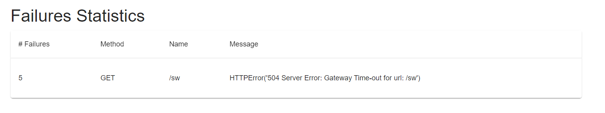
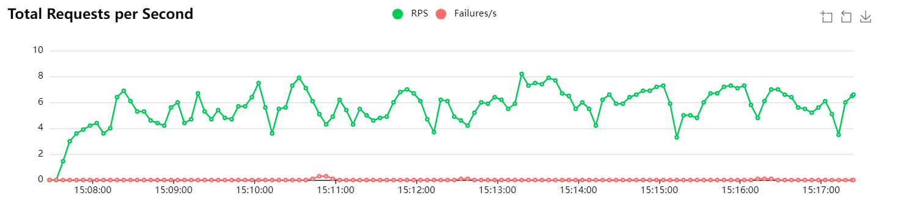
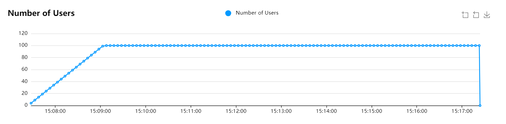

# SW API: prueba ténica

A continuación, se expone de manera detalla la estucutura, pasos y tecnologías utilizadas para realizar esta prueba técnica. 
Se ha utlizado Java 22.0.2, Apache Maven 3.9.9, Docker version 27.2.0, Minikube v1.33.1, Kubernetes 1.30.0, Locust 2.31.5 y Python 3.11.2.

## Tabla de Contenido
- [Estructura de carpetas](#estructura-de-carpetas)
- [Desarrollo del servicio](#desarrollo-del-servicio)
    - [App](#app)
    - [MakeRequest](#makerequest)
    - [MyHttpHandler](#myhttphandler)
    - [Compilación del servicio](#compilación-del-servicio)
- [Dockerización del servicio: Docker y Docker Compose](#dockerización-del-servicio-docker-y-docker-compose)
    - [Dockerfile](#dockerfile)
- [Minikube](#minikube)
    - [Manifiestos de Kubernetes](#manifiestos-de-kubernetes)
- [Locust: Load Tests](#locust-load-tests)

## Estructura de carpetas

Las carpetas y archivos que se incluyen en el desarrollo del ejercicio son:
- k8s: contiene los manifiestos de Kubernetes para desplegar el microservicio.
- sw-api: código en Java del servicio.
- docker-compose.yml: manifiesto con los servicios para el despliegue del contendor mediante Docker Compose.
- Dockerfile: fichero de construcción del contenedor de Docker.

## Desarrollo del servicio
El servicio se ha desarrollado en JAVA haciendo uso de Maven para la gestión de las dependencias.
Contamos con tres clases:

### App
Es la clase principal, en ella se inicializan los objetos necesarios para levantar el servicio.
Declaramos un objeto de tipo `HTTPServer` pasandole como parámetros tanto el host como el puerto donde correrá el servidor web. El endpoint declarado a la hora de realizar las llamadas al API es `/sw`.

### MakeRequest
Encagado de realizar las peticiones a la API externa. Se hace uso de la liberia `com.github.kevinsawicki.http.HttpRequest` para realizar las peticiones GET al endpoint `/people`.

### MyHttpHandler
Contiene la gran parte de la lógica de la respueta devuelta por el servicio. Implementando la interfaz `HTTPHandler` declaramos los métodos handle y `sort_json_array`:

#### handle
Inicializa un objeto de tipo [MakeRequest](#makerequest) (visto anteriormente) para realzar la llamada al API de Star Wars. Iniciamos comprobado el tipo de acción que se nos solicita, de esta manera todas la peticiones que no sean `GET` quedarán descartadas. Una vez obtenido el resultado lo dividimos para quedarnos unicamente con el array de `results` en el JSON de respuesta. Con ello, ordenamos de manera ascendente utilizando como criterio el atributo `name` de cada objeto del array consiguiendo asi la respuesta que enviaremos al cliente que realizó la llamada. Finalmente, contruimos la llamada indicando los encabezados y encapsulando el JSON generado anteriormente.

### sort_json_array
Para fácilitar los cambios en algunas de las funciones implementadas la ordenación de los elementos del JSON lo haremos en una función separada.
Introducimos como parámetro de entrada el JSON devuelto en la llamada a la API externa. Con ello, creamos un objeto lista con elementos de tipo `JSONObject`. Recorremos nuestro valor de entrada para crear la lista y facilitar la ordenación.

Una vez creada la lista, utilizamos la funcion sort del objeto tipo Collections, haciendo una función de comparación para el atributo `name` de cada elemento.
Por último, volvemos a introducir los elementos de la lista en un objeto `JSONArray` para finalmente retornarlo.


### Compilación del servicio
Una vez visto las clases que conforman el servicio, tenemos que construir un binario para poder usarlo.
De esta manera, mediante Maven compilamos el servicio y generamos un binario en el path `target/sw-api-1.0-SNAPSHOT.jar` que utilizaremos más tarde.</br>
```bash
mvn clean package
```


## Dockerización del servicio: Docker y Docker Compose
### Dockerfile
En el fichero Dockerfile se describen las instrucciones para construir nuestra imagen de Docker con el servicio creado anteriormente:

1. A partir de la imagen base openjdk:22 vamos a construir nuestro contenedero, de esta forma contamos con una instalación base de todo lo que necesitamos para correr una aplicación Java. </br>
`FROM openjdk:22`
2. Especificamos que queremos trabajar a partir de ahora en el directorio raiz del contenedor. </br>
`WORKDIR /`
3. Copiamos el binario .jar local al contenedor con el nombre api.jar. </br>
`COPY ./sw-api/target/*.jar api.jar`
4. Exponemos el puerto 9090 indicando que hace uso del protocolo TCP. </br>
`EXPOSE 9090/tcp`
5. Le damos un punto de entrada al contenedor con la instrucción que tiene que ejecutar para arrancar el servidor web.</br>
`ENTRYPOINT ["java", "-jar", "api.jar"]`

Una vez visto el contenido del fichero podemos construir nuestra imagen. Para ello ejecutamos el siguiente comando: </br>
```bash
docker build . -t sw-api:v2.2
```

Con al imagen construida creamos el contenedor de docker exponiendo el puerto 9090 con el mismo en la máquina afitriona:</br>
```bash
docker run -d --name sw-api -p 9090:9090 sw-api:v2.2
```

### Docker Compose
Otra manera de desplegar y administrar contenedores es mediante docker compose. Para ello se declara en el fichero docker-compose.yml los servicios que necesitamos para iniciar nuestra api.
Unicamente necesitaremos un servicio que constará de un contenedor corriendo la imagen creada `image: sw-api:v2.2`. </br>
Queremos que el contenedor tenga como politica de reinicios `restart: always` para que sin importar lo que ocurra siempre se reinice el contendor.</br>
Por último, exponemos el puerto 9090 al mismo puerto en la máquina anfitriona:
```bash
ports:
    - 9090:9090
```
Para levantar nuestros servicios ejecutamos el siguiente comando, automaticamente va a detectar el fichero *docker-compose.yml*.:</br>
```bash
docker compose up -d
```

## Minikube
Minikube nos facilita levantar un cluster de Kubernetes usando Docker como driver, para ello creamos un cluster simple con un solo nodos en la versión de Kubernetes 1.30.0:</br>
```bash
minikube start -n=1 --cpus=2 --memory=2048mb -p=devops
```

Comprobamos que nuestro cluster esté correctamente desplegado:
```bash
NAME     STATUS   ROLES           AGE   VERSION
devops   Ready    control-plane   23h   v1.30.0
```
Para que funcionen correctamente los recursos declarados en los YAMLS necesitamos habilitar algunos plugins de Minikube:
```bash
minikube addons enable ingress
minikube addons enable metrics-server
```
Por ultimo, para poder desplegar la imagen a partir del repositorio local de docker :
```bash
eval $(minikube docker-env -p devops)
```

**IMPORTANTE**: Hay que aseguirarse de [construir la imagen de docker](#dockerfile) para que exista en el repositorio local de docker y poder deplegar el microservicio.

### Manifiestos de Kubernetes

#### Deployment
El microservicio se crea con una replica inicial. Como hemos indicado anteriormente, se utiliza la imagen `sw-api:v2.2` que debe de encontrarse en el repositorio local de Docker.

``` bash
NAME                READY   UP-TO-DATE   AVAILABLE   AGE
sw-api-deployment   1/1     1            1           20h
```

#### Service
Vinculamos un servicio de Kubernetes al deployment creado para enrutas las peticiones a los pods.
``` bash
NAME         TYPE        CLUSTER-IP     EXTERNAL-IP   PORT(S)   AGE
sw-api-svc   ClusterIP   10.96.32.182   <none>        80/TCP    20h
```

#### Ingress
Para facilitar el acceso a nuestro microservicio creamos un Ingress para exponer el servicio `sw-api-svc` al exterior del cluster.

``` bash
NAME             CLASS   HOSTS   ADDRESS        PORTS   AGE
sw-api-ingress   nginx   *       192.168.58.2   80      20h
```

#### HorizontalPodAutoscaler - HPA

Para dotar al servicio de alta disponibilidad definimos un autoescalado horizontalmente en el que, una vez superado el humbral del 40% de uso de CPU en el microservicio, se demandará la creación de más pods hasta un máximo de 4.

``` bash
NAME                REFERENCE                      TARGETS       MINPODS   MAXPODS   REPLICAS   AGE
sw-api-deployment   Deployment/sw-api-deployment   cpu: 4%/40%   1         4         1          20h
```


#### Consumir el microservicio
Con todos los recursos desplegados podemos probar a consumir nuestro microservicio:

```bash
curl $(minikube ip -p devops)/sw
```


## Locust: Load Tests
Locust es una herramienta desarrollada en Python que permite lanzar pruebas de carga sobre servicios expuestos de una manera muy sencilla e intuitiva. Para instalarlo:</br>
``` bash
pip install locust
```
El fichero `locust_tests/locust.py` que pasamos como argumento es muy simple. El endpoint a donde atacaremos será ``/sw`` y el host el proporcionado por el Ingress, asumiendo una carga de 100 usuarios concurrentes durante 10 minutos con una rampa de un usuario nuevo cada segundo hasta llegar al máximo definido.

 Para ejecutar la prueba desde la consola:

```bash
locust --headless -u 100 --spawn-rate 1 -t 10m --processes 4 --host http://$(minikube ip -p devops)2 --html report.html -f locust_tests/locust.py

# --headless: no iniciamos la interfaz gráfica de Locust
# -u: número de usuarios totales
# --spawn-rate: cuandos usuarios nuevos cada segundo añadimos a la prueba
# -t: tiempo total de la prueba
# --processes: número de procesos que iniciamos sobre los que se dividirán los usuarios
# --host: host contra el que lanzar la carga
# --html: nombre y ubicación donde generar el reporte
# -f: ubicación del fichero con las pruebas
```

Estado del cluster antes de empezar la prueba:
``` bash
NAME                REFERENCE                      TARGETS       MINPODS   MAXPODS   REPLICAS   AGE
sw-api-deployment   Deployment/sw-api-deployment   cpu: 4%/40%   1         4         1          20h

NAME                                 READY   STATUS    RESTARTS   AGE
sw-api-deployment-69f7fbfc8f-wfv7d   1/1     Running   0          20h
```

Al comenzar con las pruebas de carga y antes de escalar:

``` bash
NAME                REFERENCE                      TARGETS        MINPODS   MAXPODS   REPLICAS   AGE
sw-api-deployment   Deployment/sw-api-deployment   cpu: 124%/40%   1         4         1          21h
```


Tras escalar al finalizar la prueba

``` bash
NAME                REFERENCE                      TARGETS        MINPODS   MAXPODS   REPLICAS   AGE
sw-api-deployment   Deployment/sw-api-deployment   cpu: 35%/40%   1         4         4          21h

NAME                                READY   STATUS    RESTARTS   AGE
sw-api-deployment-654587d87-8nfg8   1/1     Running   0          21h
sw-api-deployment-654587d87-gm2d4   1/1     Running   0          4m36s
sw-api-deployment-654587d87-gmjcs   1/1     Running   0          2m36s
sw-api-deployment-654587d87-wmw56   1/1     Running   0          2m36s
```

Locust nos permite generar un reporte con lo ocurrido durante la prueba. En el podemos ver estadisticas y métricas asi como la evolución del tiempo de respuesta en las llamadas, la rampa de usuarios concurrentes, la tasa de errores que hemos tenido en las peticiones y los errores obtenidos en las respuestas del servidor.

El número total de peticiones ha sido 2759 repartidos entre los 100 usuarios durante los 10 minutos que ha dudado la prueba. Estás tablas indican unas estadisticas a grandes rasgos sobre como se ha comportado el microservicios, unicamente hemos realizado llamadas al endpoint `/sw` teniendo 5 peticiones erroneas, entendiendo como error toda aquella petición que no hayan obetenido una respuesta 200. La media de latencia se encuentra en los 10 segundos.


En la siguiente tabla se pueden apreciar los tipos de errores obtenidos. Unicamente encontramos errores 504, esto se debe a que cuando el microservicio no ha escalado y llega a un consumo de recursos superior a lo que puede gestionar se ve sobrepasado, motivo por el cual escalará más adelante.



Por último, contamos con tres tablas donde podemos observar la evolución en el tiempo del total de peticiones por segundo, el tiempo de respuesta de las peticiones y la rampa de usuarios concurrentes realizando las llamadas.<br>

La peticiones son constantes durante toda la prueba. La mayoria de ellas son exitosas como se ha mencionado anteriormente.




Al comienzo de la ejecución los tiempos de respuesta son bajos, no superan los dos segundos. Cuantos más usuarios se van sumando a realizar peticiones se ve como va degradando el tiempo que tarde en devolvernos la respuesta el servidor.

.png)

Presenta de menera gráfica como ha evolucionado la rampa de usuarios durante la ejecución, partiendo de un usuario y añadiendo uno nuevo cada segundo. Finalmente, llegaremos a tener los 100 usuarios concurrentes hasta finalizar la prueba.

